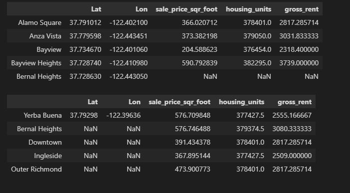
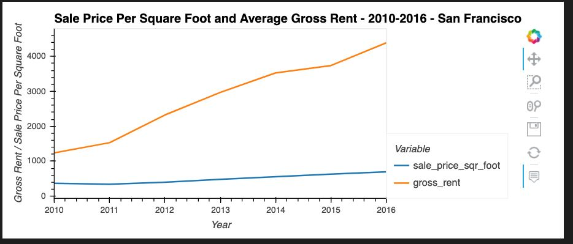
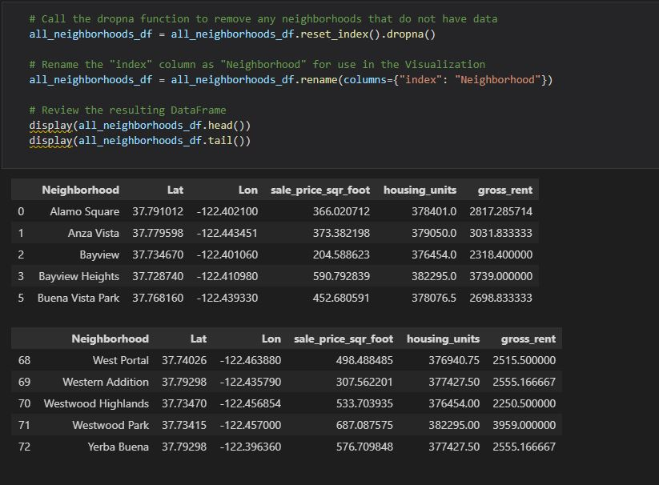

# Housing_Rental_Analysis_San_Francisco

## Overview

Proptech, the application of technology to real-estate markets, is an innovative domain in the fintech industry. Assume that you’re an analyst at a proptech company that wants to offer an instant, one-click service for people to buy properties and then rent them. 

The company wants to have a trial of this offering in the San Francisco real-estate market. If the service proves popular, they can then expand to other markets.

Your job is to use your data visualization superpowers, including aggregation, interactive visualizations, and geospatial analysis, to find properties in the San Francisco market that are viable investment opportunities.

## Visulaizations

